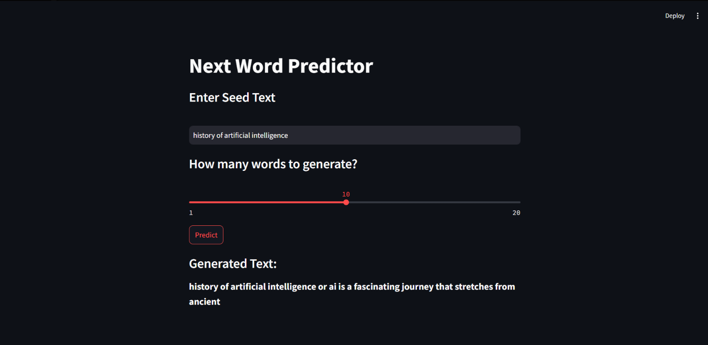

# next_word_predictor_lstm_streamlit

This is the streamlit application that is based on the topic History of Artificial Intelligence by using LSTM

# 🧠 Next Word Predictor

A smart and interactive **Streamlit web app** that uses an **LSTM-based deep learning model** to predict the next word(s) in a sentence. Just enter a starting phrase and let the model continue your thought!



## 📸 Preview

> **Input Seed Text:**  
> `history of artificial intelligence`
>
> **Generated Output:**  
> `history of artificial intelligence or ai is a fascinating journey that stretches from ancient`

---

## 🧰 Tech Stack

| Tool                   | Purpose                             |
| ---------------------- | ----------------------------------- |
| **TensorFlow / Keras** | Training and serving the LSTM model |
| **Streamlit**          | Frontend web interface              |
| **Pickle**             | Saving/loading model/tokenizer      |
| **NumPy**              | Efficient numerical operations      |

## 🚀 How to Run Locally

1. **Clone the Repository**
   ```bash
   git clone https://github.com/Pritam216/next-word-predictor.git
   cd next-word-predictor
   ```


2. **Install Required Libraries**

   ```bash
   pip install -r requirements.txt
   ```

3. **Launch the Streamlit App**

   ```bash
   streamlit run streamlit_app.py
   ```

4. **Interact!**

   * Enter a seed text
   * Choose how many words you want to generate
   * Click “Predict” and enjoy the result!

---

## 📦 Sample `requirements.txt`

You can create this file if not already present:

```txt
streamlit
tensorflow
numpy
pickle-mixin
```

---

## 💡 Use Cases

* 🤖 AI writing assistants
* ✍️ Creative writing generators
* 🧠 NLP research experiments
* 💬 Chatbot seed expansion
* 📚 Educational projects to learn LSTM text generation

---

## 🙌 Acknowledgments

Built using:

* [TensorFlow](https://www.tensorflow.org/)
* [Keras](https://keras.io/)
* [Streamlit](https://streamlit.io/)

## 👨‍💻 Author

Made with ❤️ by \[Pritam Kumar Roy]
Connect on [LinkedIn](https://www.linkedin.com/in/pritamkumarroy/) | Follow on [GitHub](https://github.com/Pritam216)

---

> ⚠️ **Note:** This app uses a pre-trained model. For best results, consider training on a domain-specific dataset.

```
